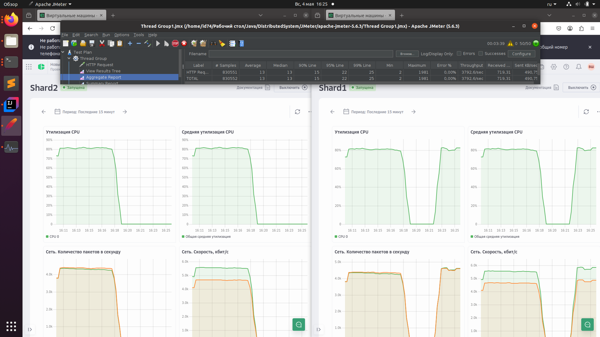
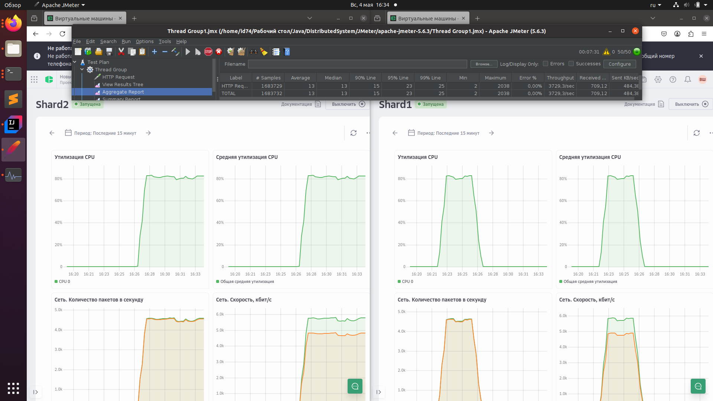
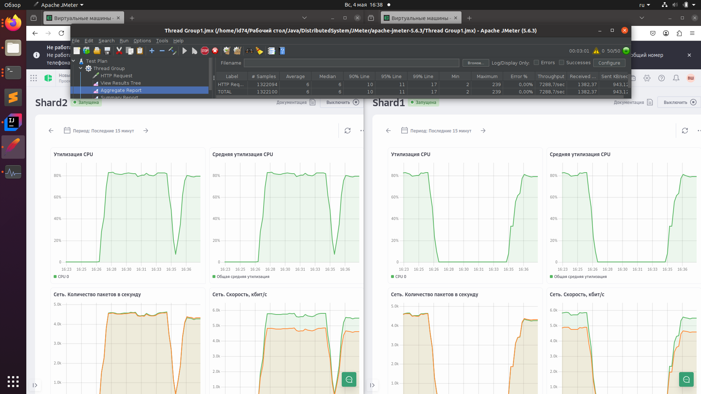

Положить ключ:
```
curl -X POST "http://localhost:8080/api/put?key=age&value=23"
```
Достать по ключу:
```
curl -X GET "http://localhost:8080/api/get?key=age"
```

# Нагрузочное тестирование (имплементация через хэш-таблицу в памяти):
Проводилось с использованием Apache JMeter, файл, описывающий тестирование - Thread Group1.jmx
И сервис, и JMeter запускались на одном и том же ноутбуке (6 ядер + 16 ГБ RAM, на зарядке)
## Чтение
[Запрос: `/api/get?key=age`
Достигает обработанных 40000 запросов / в секунду при 5000 потоков, 35000 при 20000.
]()

## Запись
Запрос: `/api/put?key=age&value=23`
Достигает обработанных 40000 запросов / в секунду при 5000 потоков, и 32000 при 20000 потоков. Заметим, однако, что запись из разных потоков здесь не синхронизирована (а стоило бы), поэтому rps почти как при чтении; при добавлении синхронизации можно было бы ожидать сильной просадки.


# Поднять Postgresql в Docker
```
docker run -it --name java_postgres \
  -e POSTGRES_USER=postgres \
  -e POSTGRES_PASSWORD=mysecretpassword \
  -e POSTGRES_DB=java_db \
  -p 5432:5432 \
  postgres
```

# Сравнительные замеры
Теперь измеряем с 100 потоков, ждём по 30 секунд
## Post
InMemoryNonConcurrentStorage:

InMemoryConcurrentStorage:

DockerPostgreSQLStorage:

## Get
InMemoryNonConcurrentStorage:

InMemoryConcurrentStorage:

DockerPostgreSQLStorage:

## Однопоточный на примере InMemoryConcurrentStorage
Get:

Post:


Дальше только get:

Для примера JMeter Postgresql, со стандартными настройками Postgresql (с контроллером DockerPostgreSQLStorage):
с 1 потоком - 1700 TPS

с 2 потоками - 2915 TPS

с 5 потоками - 2920 TPS

с 25 потоками - 3030 TPS

Видим очень жесткое ограничение по TPS, судя по всему это происходит из-за того, что всего одно подключение к Postgresql на все потоки, естественно, concurrency там особого не получается.
Сначала пробуем открывать соединение в начале каждого get; это очень плохая идея, на 1 поток около 75 транзакций получается (такое стыдно скриншотить), это можно использовать разве что для измерения времени открытие соединения + его закрытие.
Однако мы понимаем, что упираемся в отсутствие concurrency из-за одного соединения, поэтому есть решение - пул соединений с помощью HikariCP.
Делаем пул соединений в Java-приложении, используем HikariCPDockerPostgreSQLStorage()
с 1 потоком - 1730 TPS

с 2 потоками - 2915 TPS

с 5 потоками - 8100 TPS

с 25 потоками - 17300 TPS

с 75 потоками - 15800 TPS

Видим высокую утилизацию CPU, что мы и хотели получить, 16000 TPS Postgresql на чтение вполне себе выдает.
Заметим, что тут нет особо смысла пытаться настроить max_connections внутри postgres, потому оно равно 100:
```
docker exec -it java_postgres psql -U postgres -c "SHOW max_connections;"
 max_connections 
-----------------
 100
(1 row)
```
А так как 100 > 75, то мы просто напросто не упираемся в этот предел, нет смысла увеличивать это число.

# Шардирование
Прежде всего попробуем локально поднять 2 экземпляра postgresql:
```
docker run -it --name java_postgres1 \
    -e POSTGRES_USER=postgres \
    -e POSTGRES_PASSWORD=mysecretpassword \
    -e POSTGRES_DB=java_db1 \
    -p 5432:5432 \
    postgres

docker run -it --name java_postgres2 \
    -e POSTGRES_USER=postgres \
    -e POSTGRES_PASSWORD=mysecretpassword \
    -e POSTGRES_DB=java_db2 \
    -p 5433:5432 \
    postgres
```
С помощью этого можно протестировать класс ShardHikariCPDockerPostgreSQLStorage.
А теперь перейдем к организации настоящего шардирования. Арендуем сервера на cloud.ru. Два сервера (ip устареют к моменту выкладки):
ShardJavaPostgresql1: ip - 176.108.253.103
ShardJavaPostgresql2: ip - 88.218.67.165
Конфигурация у них следующая:

На каждом сервере накачена Ubuntu 22.04, на каждую установлен postgresql
Настройки:
1) Начинаем с того, что делаем ssh пару
2) В /etc/ssh/sshd_config (и в подключенные файлы) докинем `PasswordAuthentication yes`, пусть будет
3) Дописываем:
  sudo nano /etc/postgresql/14/main/postgresql.conf
    listen_addresses = '*'
4) Дописываем:
  sudo nano /etc/postgresql/14/main/pg_hba.conf
    host  all  all  0.0.0.0/0  md5
5) Настраиваем файервол (хоть вроде он и выключен):
   sudo ufw allow 5432/tcp
6) Заходим в postgresql и создаем базу данных, устанавливаем наш пароль:
   sudo -u postgres psql
   postgres=# CREATE DATABASE java_db1;
   postgres=# ALTER USER postgres WITH PASSWORD 'mysecretpassword';
7) Видим, что подключиться через telnet на 5432 порт всё равно нельзя; может это ограничение провайдера, поэтому делаем такой хак:
   ssh -L 5433:localhost:5432 user1@88.218.67.165
   ssh -L 5434:localhost:5432 user1@176.108.253.103
8) Теперь мы можем подключаться к удаленным серверам через localhost
## Тестирование шардирования
План тестирования следующий: взять 2 ключа, которые попадут сначала на первый сервер, потом 2, которые попадут на второй, потом 2 таких, что один попадает на первый, другой на второй - тут мы должны увидеть пропускную способность как сумму двух предыдущих.
Добавим в jmeter в Thread Group: CSV Data Set Config - будем держать там по 2 ключа, соответственно, для каждой из трех ситуаций свои
Для сервера 1 ключи: age1 и age3
Для сервера 2 ключи: age и age2
Не забудем увеличить shardXConfig.setMaximumPoolSize до 50
Не забываем также посмотреть, что max_connections в Postgresql больше, чем пул соединений в нашем Java-приложении:
```
postgres=# SHOW max_connections;
max_connections
-----------------
100
(1 row)
```
Не удалось загрузить удаленные сервера на 100%, сделаем их послабее, пересоздадим с 1 vCPU и 2 ГБ RAM.
Переустанавливаем заново:
```
sudo apt update
sudo apt install postgresql postgresql-contrib -y
sudo systemctl status postgresql
```
Сервера пока не работают:
```
user1@javashard1:~$ sudo systemctl status postgresql
● postgresql.service - PostgreSQL RDBMS
     Loaded: loaded (/lib/systemd/system/postgresql.service; enabled; vendor preset: enabled)
     Active: active (exited) since Sun 2025-04-27 18:27:51 MSK; 44s ago
    Process: 29713 ExecStart=/bin/true (code=exited, status=0/SUCCESS)
   Main PID: 29713 (code=exited, status=0/SUCCESS)
```
Ладно, на самом деле смотреть надо было через
```
systemctl status postgresql@16-main.service
```
Ну и переустановили ОС на виртуалках на Ubuntu24, теперь всё работает.
Вспоминаем, что на каждая текущая машина - 1 vCPU, 2 GB RAM, 10% гарантированногго времени. Запускать будем по 50 потоков в Apache JMeter, этого хватает для полной нагрузки (и это < 50% моего локального CPU, что радует).
Начнем с ключей age и age2

Затем age1 и age2:

А теперь разные ключи:

Видим, что шарды выдают честные 3800 и 3730 TPS, и достаточно подгружены оба (по 80%), а при одновременном задействовании обоих получаем уже 7300 TPS, что примерно равно сумме этих TPS (с той же подгруженностью в 80%, видимо это какая-то особенность отображения).
Вспоминая, что во всех тестах было по 50 потоков в JMeter - делаем вывод, что шардирование действительно дало нам масштабирование в раза на нашем тестовом сценарии.