Положить ключ:
```
curl -X POST "http://localhost:8080/api/put?key=age&value=23"
```
Достать по ключу:
```
curl -X GET "http://localhost:8080/api/get?key=age"
```

# Нагрузочное тестирование (имплементация через хэш-таблицу в памяти):
Проводилось с использованием Apache JMeter, файл, описывающий тестирование - Thread Group1.jmx
И сервис, и JMeter запускались на одном и том же ноутбуке (6 ядер + 16 ГБ RAM, на зарядке)
## Чтение
[Запрос: `/api/get?key=age`
Достигает обработанных 40000 запросов / в секунду при 5000 потоков, 35000 при 20000.
]()

## Запись
Запрос: `/api/put?key=age&value=23`
Достигает обработанных 40000 запросов / в секунду при 5000 потоков, и 32000 при 20000 потоков. Заметим, однако, что запись из разных потоков здесь не синхронизирована (а стоило бы), поэтому rps почти как при чтении; при добавлении синхронизации можно было бы ожидать сильной просадки.


# Поднять Postgresql в Docker
```
docker run -it --name java_postgres \
  -e POSTGRES_USER=postgres \
  -e POSTGRES_PASSWORD=mysecretpassword \
  -e POSTGRES_DB=java_db \
  -p 5432:5432 \
  postgres
```

# Сравнительные замеры
Теперь измеряем с 100 потоков, ждём по 30 секунд
## Post
InMemoryNonConcurrentStorage:
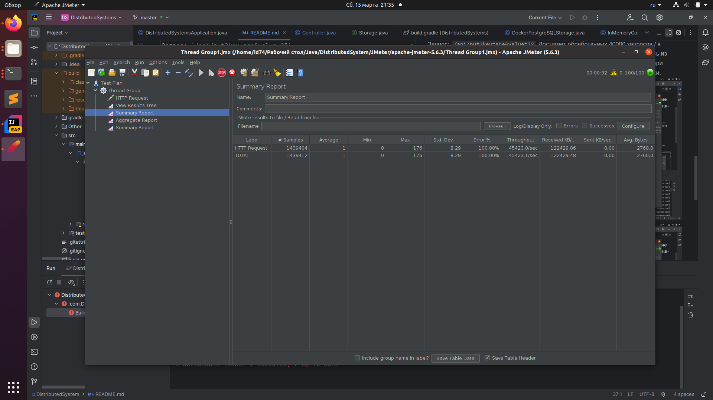
InMemoryConcurrentStorage:
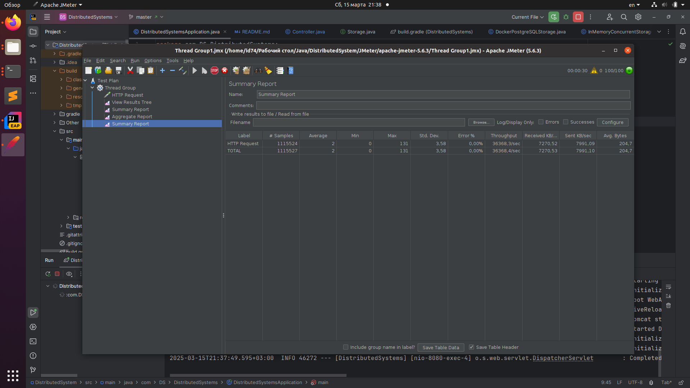
DockerPostgreSQLStorage:
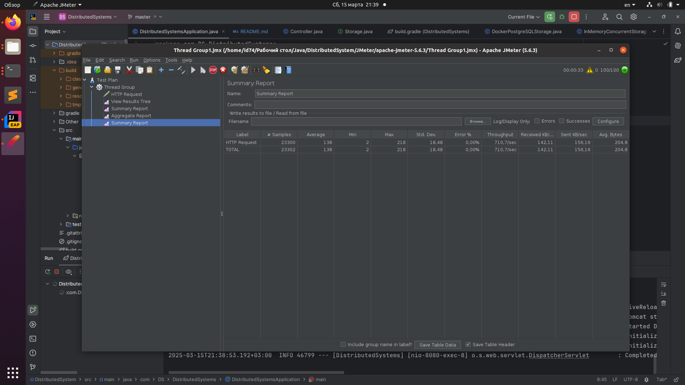
## Get
InMemoryNonConcurrentStorage:
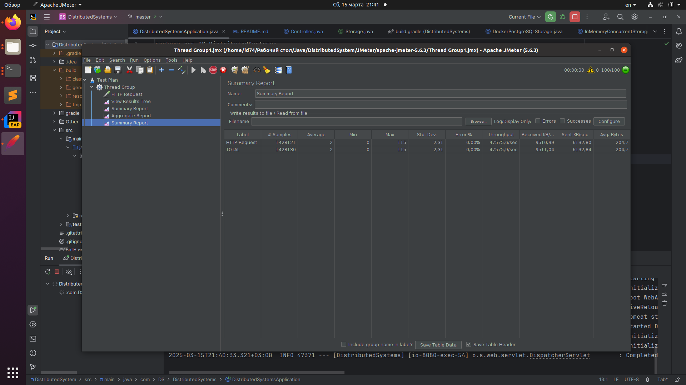
InMemoryConcurrentStorage:

DockerPostgreSQLStorage:
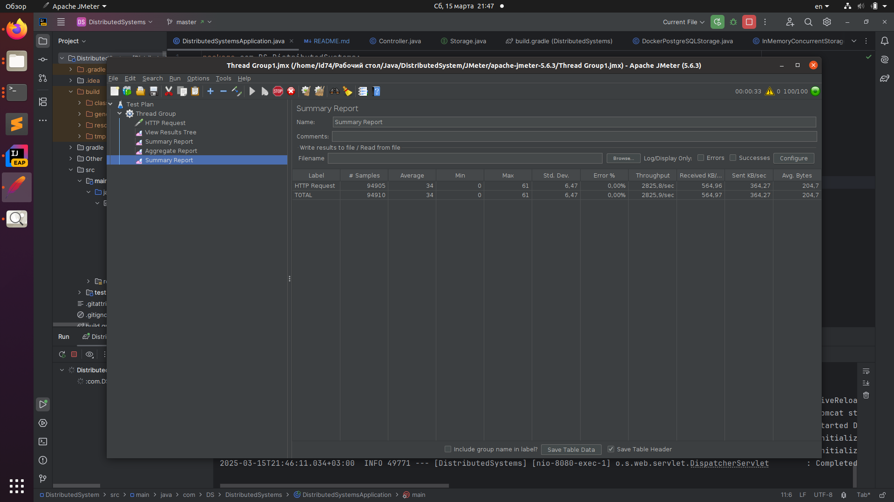
## Однопоточный на примере InMemoryConcurrentStorage
Get:
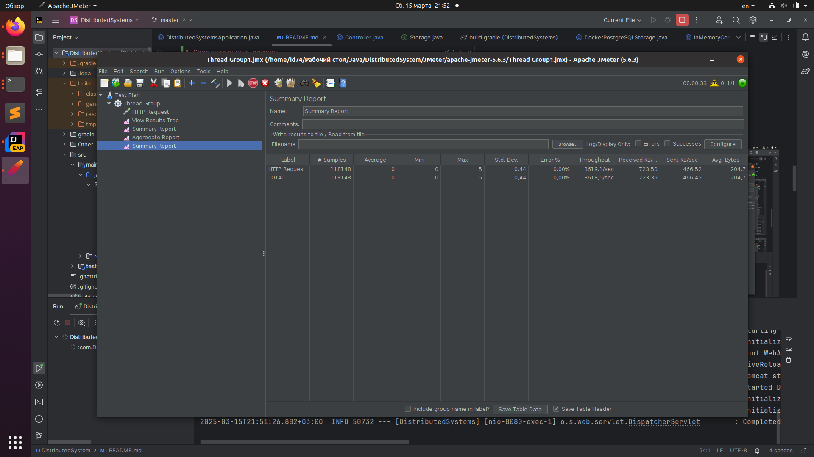
Post:
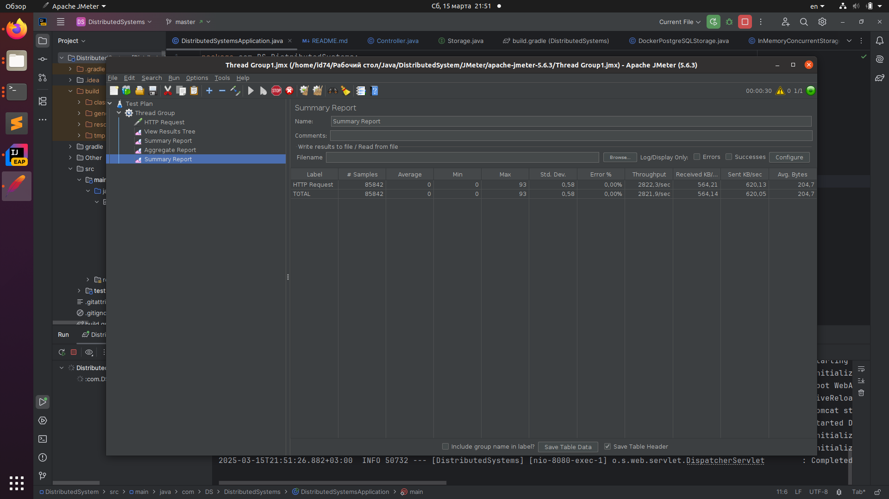

Дальше только get:

Для примера JMeter Postgresql, со стандартными настройками Postgresql (с контроллером DockerPostgreSQLStorage):
с 1 потоком - 1700 TPS
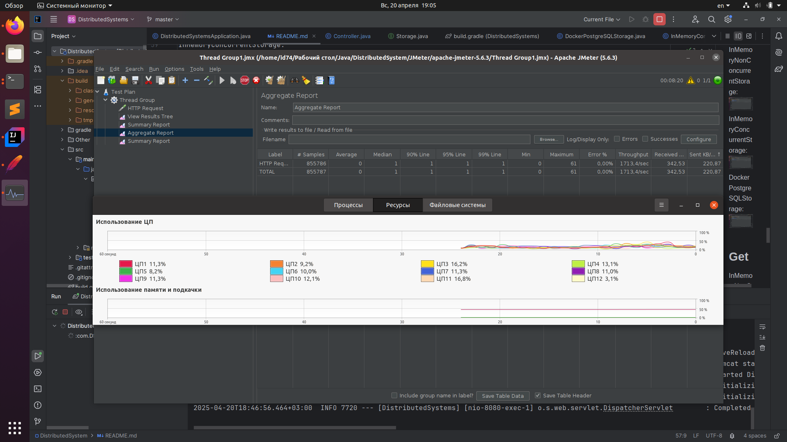
с 2 потоками - 2915 TPS
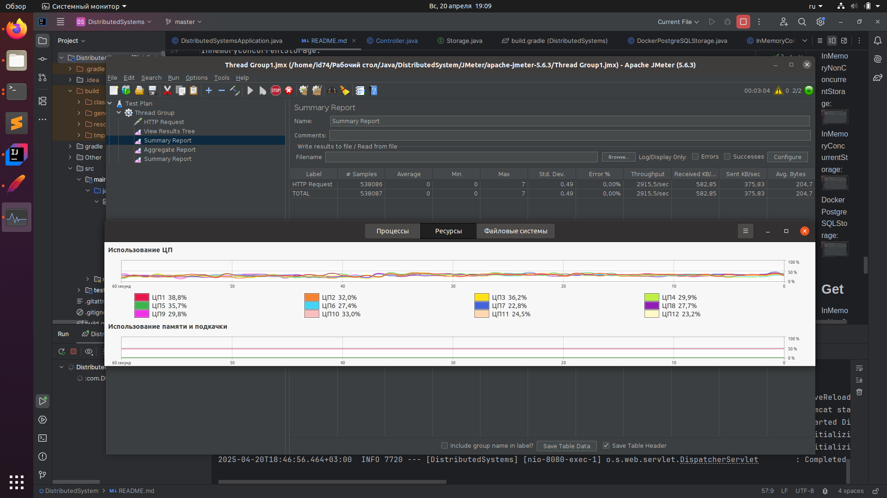
с 5 потоками - 2920 TPS
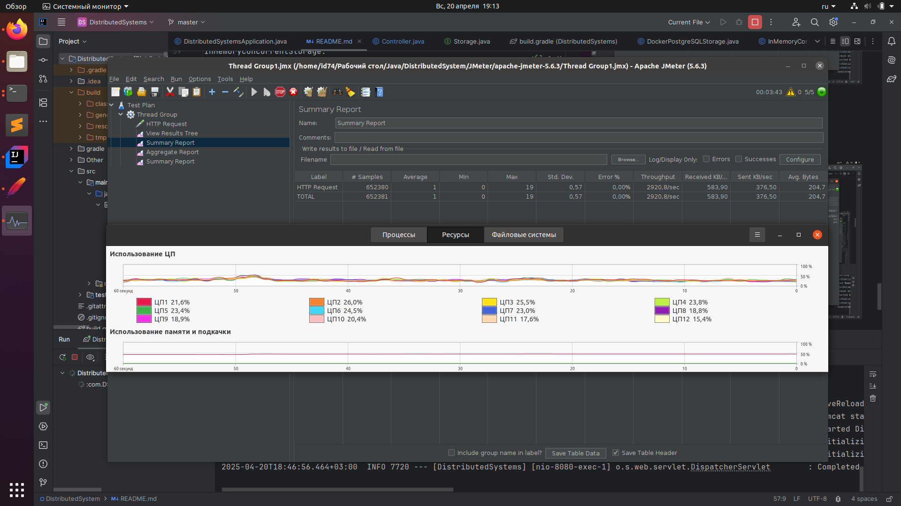
с 25 потоками - 3030 TPS
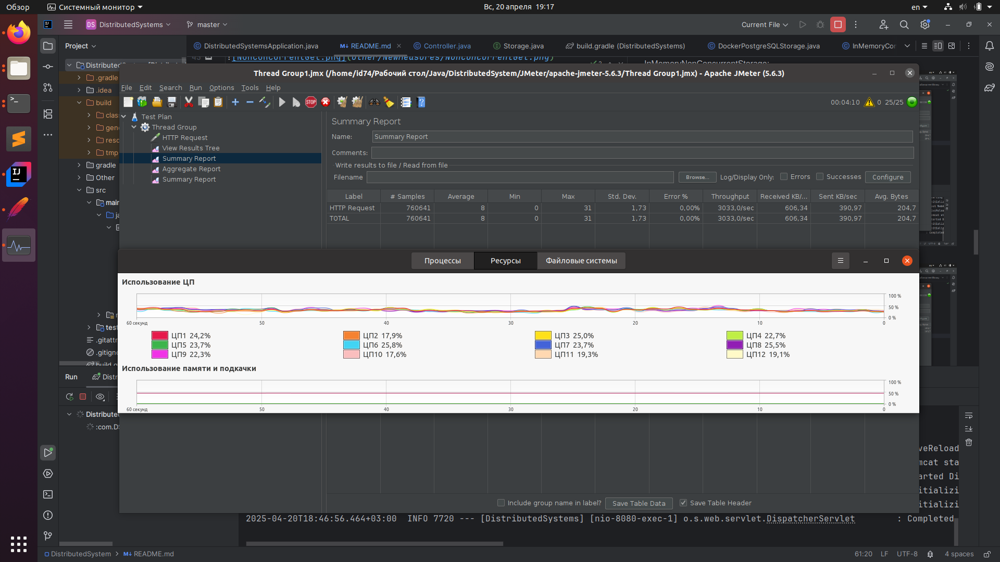
Видим очень жесткое ограничение по TPS, судя по всему это происходит из-за того, что всего одно подключение к Postgresql на все потоки, естественно, concurrency там особого не получается.
Сначала пробуем открывать соединение в начале каждого get; это очень плохая идея, на 1 поток около 75 транзакций получается (такое стыдно скриншотить), это можно использовать разве что для измерения времени открытие соединения + его закрытие.
Однако мы понимаем, что упираемся в отсутствие concurrency из-за одного соединения, поэтому есть решение - пул соединений с помощью HikariCP.
Делаем пул соединений в Java-приложении, используем HikariCPDockerPostgreSQLStorage()
с 1 потоком - 1730 TPS
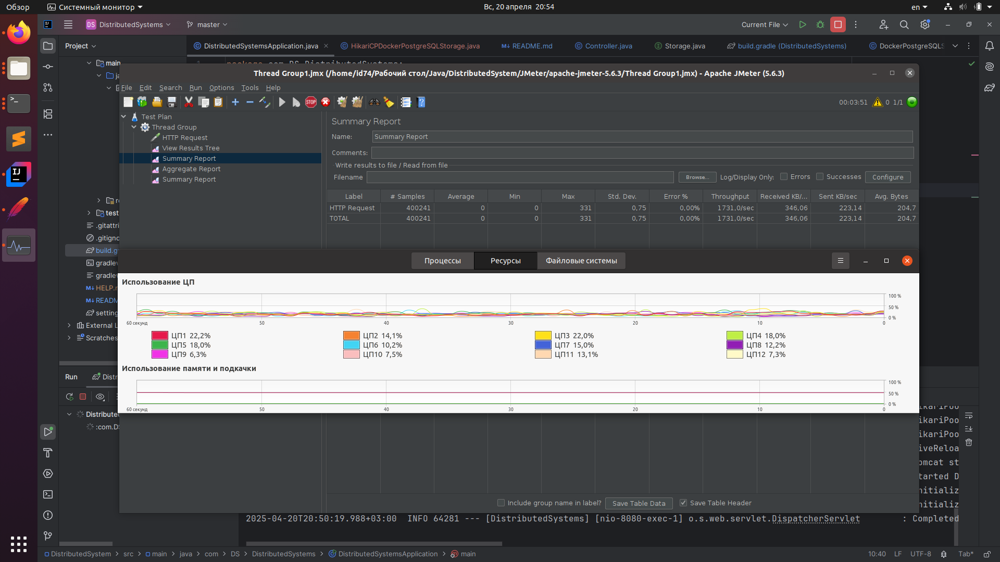
с 2 потоками - 2915 TPS
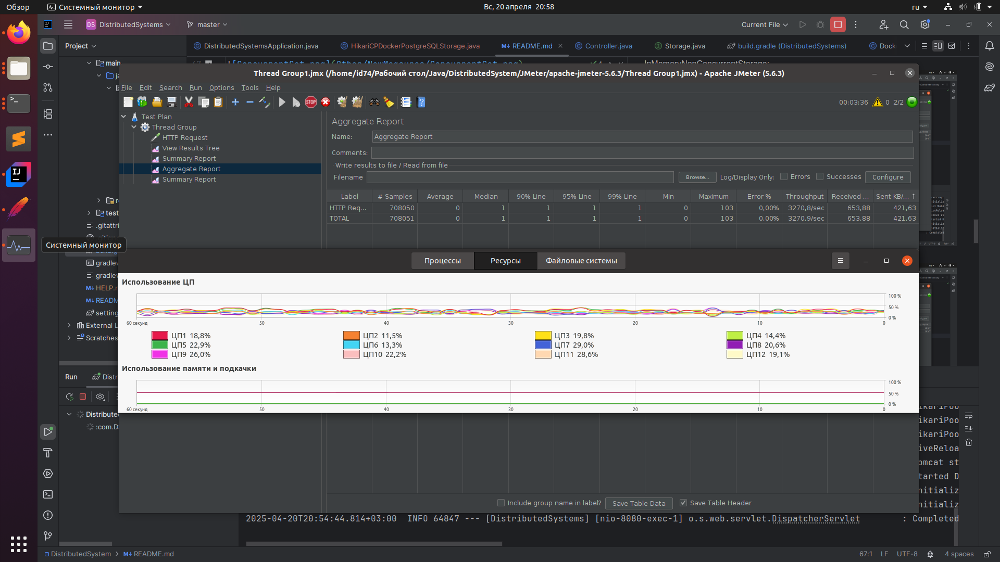
с 5 потоками - 8100 TPS
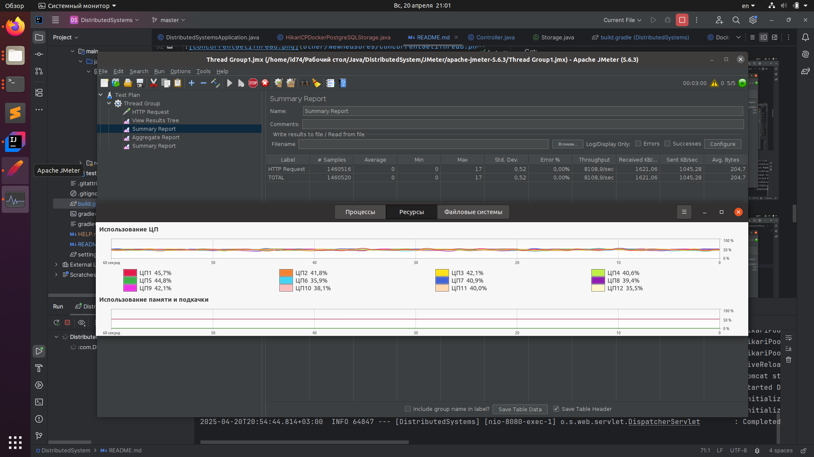
с 25 потоками - 17300 TPS
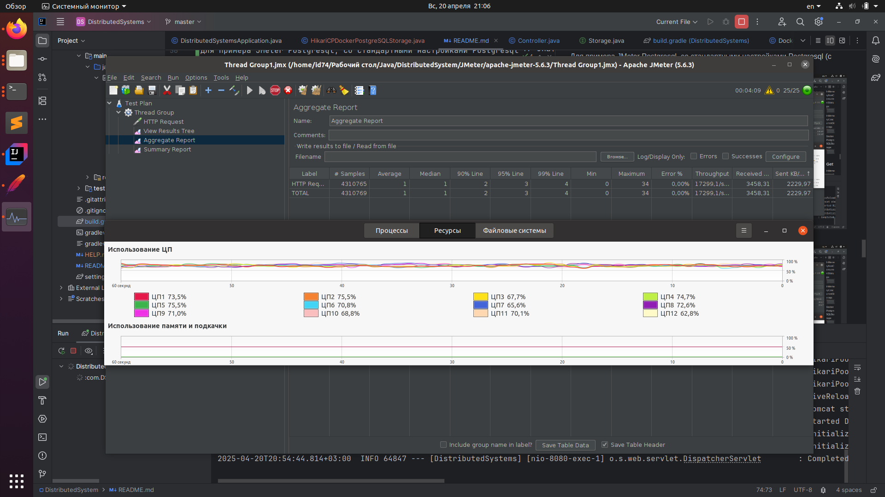
с 75 потоками - 15800 TPS
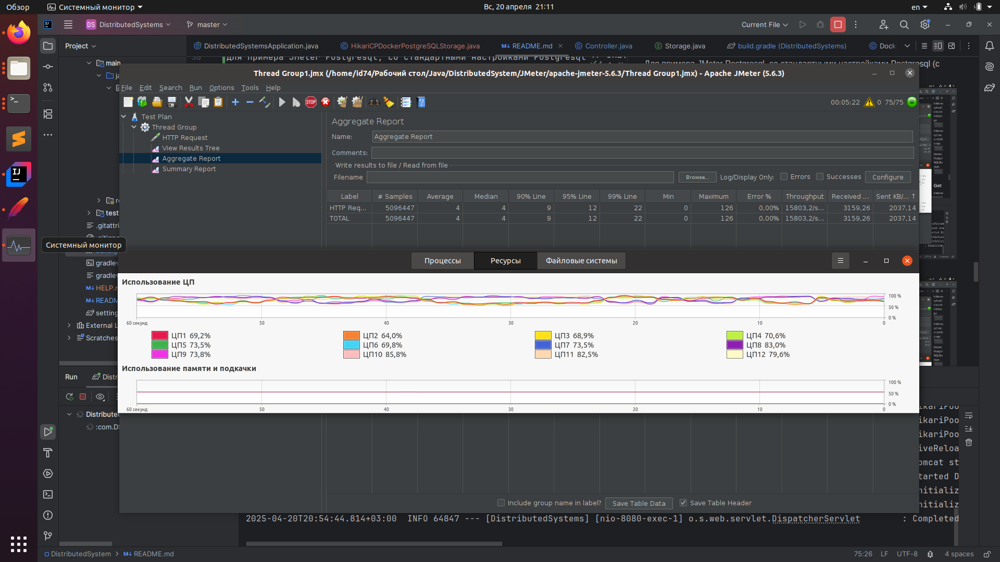
Видим высокую утилизацию CPU, что мы и хотели получить, 16000 TPS Postgresql на чтение вполне себе выдает.
Заметим, что тут нет особо смысла пытаться настроить max_connections внутри postgres, потому оно равно 100:
```
docker exec -it java_postgres psql -U postgres -c "SHOW max_connections;"
 max_connections 
-----------------
 100
(1 row)
```
А так как 100 > 75, то мы просто напросто не упираемся в этот предел, нет смысла увеличивать это число.
