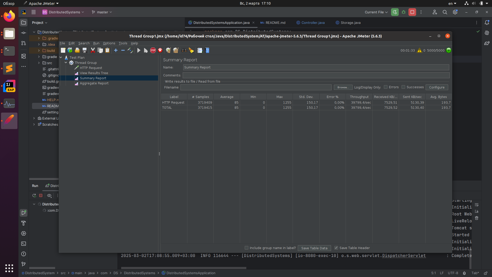
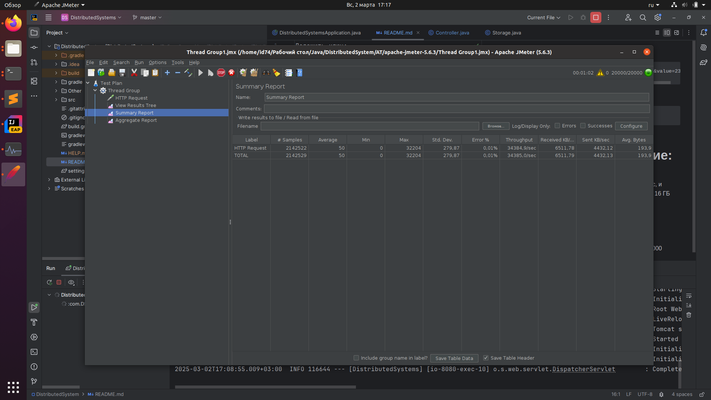
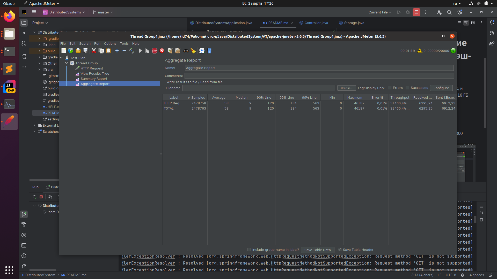

Положить ключ:
```
curl -X POST "http://localhost:8080/api/put?key=age&value=23"
```
Достать по ключу:
```
curl -X GET "http://localhost:8080/api/get?key=age"
```

# Нагрузочное тестирование (имплементация через хэш-таблицу в памяти):
Проводилось с использованием Apache JMeter, файл, описывающий тестирование - Thread Group1.jmx
И сервис, и JMeter запускались на одном и том же ноутбуке (6 ядер + 16 ГБ RAM, на зарядке)
## Чтение
Запрос: `/api/get?key=age`
Достигает обработанных 40000 запросов / в секунду при 5000 потоков, 35000 при 20000.


## Запись
Запрос: `/api/put?key=age&value=23`
Достигает обработанных 40000 запросов / в секунду при 5000 потоков, и 32000 при 20000 потоков. Заметим, однако, что запись из разных потоков здесь не синхронизирована (а стоило бы), поэтому rps почти как при чтении; при добавлении синхронизации можно было бы ожидать сильной просадки.



# Поднять Postgresql в Docker
```
docker run -it --name java_postgres \
  -e POSTGRES_USER=postgres \
  -e POSTGRES_PASSWORD=mysecretpassword \
  -e POSTGRES_DB=java_db \
  -p 5432:5432 \
  postgres
```